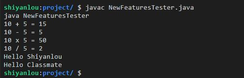
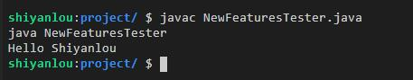
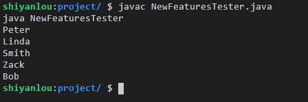
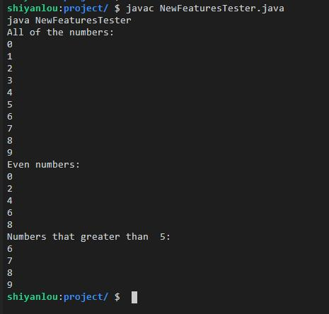
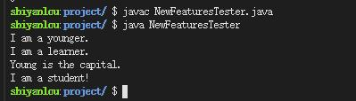
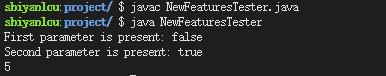
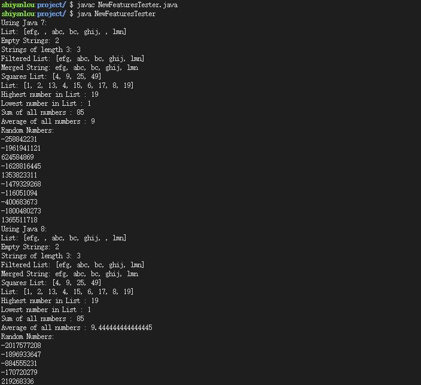

[toc]

# Lambda 表达式

Lambda 表达式是在 Java 8 中引入的，并且成为了 Java 8 最大的特点。它使得功能性编程变得非常便利，极大地简化了开发工作。

## Lambda 表达式的语法与特征

一个 Lambda 表达式具有下面这样的语法特征。它由三个部分组成：第一部分为一个括号内用逗号分隔的参数列表，参数即函数式接口里面方法的参数；第二部分为一个箭头符号：->；第三部分为方法体，可以是表达式和代码块。语法如下：
```
parameter -> expression body
```

下面列举了 Lambda 表达式的几个最重要的特征：

+ **可选的类型声明**：你不用去声明参数的类型。编译器可以从参数的值来推断它是什么类型。
+ **可选的参数周围的括号**：你可以不用在括号内声明单个参数。但是对于很多参数的情况，括号是必需的。
+ **可选的大括号**：如果表达式体里面只有一个语句，那么你不必用大括号括起来。
+ **可选的返回关键字**：如果表达式体只有单个表达式用于值的返回，那么编译器会自动完成这一步。若要指示表达式来返回某个值，则需要使用大括号。

Java 语言的设计者们思考了很多如何让现有的功能和 Lambda 表达式友好兼容。于是就有了函数接口这个概念。**函数接口是一种只有一个方法的接口，函数接口可以隐式地转换成 Lambda 表达式。**

> **函数式接口的重要属性是**：我们能够使用 Lambda 实例化它们，Lambda 表达式让你能够将函数作为方法参数，或者将代码作为数据对待。Lambda 表达式的引入给开发者带来了不少优点：在 Java 8 之前，匿名内部类，监听器和事件处理器的使用都显得很冗长，代码可读性很差，Lambda 表达式的应用则使代码变得更加紧凑，可读性增强；Lambda 表达式使并行操作大集合变得很方便，可以充分发挥多核 CPU 的优势，更易于为多核处理器编写代码。

## 一个Lambda表达式的例子

```java
public class NewFeaturesTester{
    public static void main(String args[]){
        NewFeaturesTester tester = new NewFeaturesTester();

        /*--- Lambda 表达式可以实现接口 ---*/
        // 带有类型声明的表达式
        MathOperation addition = (int a, int b) -> a + b;

        // 没有类型声明的表达式
        MathOperation subtraction = (a, b) -> a - b;

        // 带有大括号、带有返回语句的表达式
        MathOperation multiplication = (int a, int b) -> { return a * b; };

        // 没有大括号和 return 语句的表达式
        MathOperation division = (int a, int b) -> a / b;

        // 输出结果
        System.out.println("10 + 5 = " + tester.operate(10, 5, addition));
        System.out.println("10 - 5 = " + tester.operate(10, 5, subtraction));
        System.out.println("10 x 5 = " + tester.operate(10, 5, multiplication));
        System.out.println("10 / 5 = " + tester.operate(10, 5, division));

        // 没有括号的表达式
        GreetingService greetService1 = message ->
        System.out.println("Hello " + message);

        // 有括号的表达式
         GreetingService greetService2 = (message) ->
        System.out.println("Hello " + message);

        // 调用 sayMessage 方法输出结果
        greetService1.sayMessage("Shiyanlou");
        greetService2.sayMessage("Classmate");
    }

    // 下面是定义的一些接口和方法(函数式接口)
    interface MathOperation{
        int operation(int a, int b);
    }

    interface GreetingService{
        void sayMessage(String message);
    }

    private int operate(int a, int b, MathOperation mathOperation){
        return mathOperation.operation(a, b);
    }
}
```



> 总结

+ Lambda 表达式优先用于定义功能接口在行内的实现，即单个方法只有一个接口。
+ Lambda 表达式让匿名类不再需要，这为 Java 增添了简洁但实用的函数式编程能力

## Lambda 的作用域

将以上代码更改为：
```java
public class NewFeaturesTester{
    final static String salutation = "Hello ";     // 正确，不可再次赋值
    // static String salutation = "Hello ";        // 正确，可再次赋值
    // String salutation = "Hello ";               // 报错
    // final String salutation = "Hello ";         // 报错

    public static void main(String args[]){
        // final String salutation = "Hello ";     // 正确，不可再次赋值
        // String salutation = "Hello ";           // 正确，隐性为 final，不可再次赋值

        // salution = "welcome to "
        GreetingService greetService1 = message ->
        System.out.println(salutation + message);
        greetService1.sayMessage("Shiyanlou");
    }

    interface GreetingService{
       void sayMessage(String message);
    }
}
```


根据以上代码可以得出结论：
+ 可访问 static 修饰的成员变量，如果是 final static 修饰，不可再次赋值，只有 static 修饰可再次赋值。
+ 可访问表达式外层的 final 局部变量（不用声明为 final，隐性具有 final 语义），不可再次赋值。

## 方法引用

> 方法也是一种对象，可以通过名字来引用。不过方法引用的唯一用途是支持 Lambda 的简写，使用方法名称来表示 Lambda。不能通过方法引用来获得诸如方法签名的相关信息。

方法引用提供了一个很有用的语义来直接访问类或者实例的已经存在的方法或者构造方法。

方法引用可以通过方法的名字来引用其本身。方法引用是通过双冒号 :: 来描述的。

它可以用来引用下列类型的方法：

+ **构造器引用**。语法是 `Class::new`，或者更一般的 Class< T >::new，要求构造器方法是没有参数。
+ **静态方法引用**。语法是 `Class::static_method`，要求接受一个 Class 类型的参数。
+ **特定类的任意对象方法引用**。它的语法是 `Class::method`，要求方法是没有参数的。
+ **特定对象的方法引用**，它的语法是`instance::method`。要求方法接受一个参数，与 3 不同的地方在于，3 是在列表元素上分别调用方法，而 4 是在某个对象上调用方法，将列表元素作为参数传入。

更多对于方法引用的介绍，可以参考这一篇博文—— java8 - 方法引用(method referrance)

下面是一个简单的方法引用的例子:
```java
import java.util.List;
import java.util.ArrayList;

public class NewFeaturesTester{

    public static void main(String args[]){
        List<String> names = new ArrayList<>();

        names.add("Peter");
        names.add("Linda");
        names.add("Smith");
        names.add("Zack");
        names.add("Bob");

        // 通过 System.out::println 引用了输出的方法
        names.forEach(System.out::println);
    }
}
```


# 函数式接口

函数式接口通过一个单一的功能来表现。例如，带有单个 compareTo 方法的比较接口，被用于比较的场合。Java 8 开始定义了大量的函数式接口来广泛地用于 Lambda 表达式。

> Java 8 引入的一个核心概念是函数式接口（Functional Interfaces）。通过在接口里面添加一个抽象方法，这些方法可以直接从接口中运行。如果一个接口定义唯一一个抽象方法，那么这个接口就成为函数式接口。同时，引入了一个新的注解：`@FunctionalInterface`。可以把他它放在一个接口前，表示这个接口是一个函数式接口。这个注解是非必须的，只要接口只包含一个方法的接口，虚拟机会自动判断，不过最好在接口上使用注解 `@FunctionalInterface` 进行声明。在接口中添加了 `@FunctionalInterface` 的接口，只允许有一个抽象方法，否则编译器也会报错。

## 函数式相关的接口及描述

|接 口|描 述|
|-----|-----|
|BitConsumer<T,U>	|该接口代表了接收两个输入参数 T、U，并且没有返回的操作|
|BiFunction<T,U,R>	|该接口代表提供接收两个参数 T、U，并且产生一个结果 R 的方法|
|BinaryOperator		|代表了基于两个相同类型的操作数，产生仍然是相同类型结果的操作|
|BiPredicate<T,U>	|代表了对两个参数的断言操作（基于 Boolean 值的方法）|
|BooleanSupplier	|代表了一个给出 Boolean 值结果的方法|
|Consumer			|代表了接受单一输入参数并且没有返回值的操作|
|DoubleBinaryOperator|代表了基于两个 Double 类型操作数的操作，并且返回一个 Double 类型的返回值|
|DoubleConsumer		|代表了一个接受单个 Double 类型的参数并且没有返回的操作|
|DoubleFunction		|代表了一个接受 Double 类型参数并且返回结果的方法|
|DoublePredicate	|代表了对一个 Double 类型的参数的断言操作|
|DoubleSupplier		|代表了一个给出 Double 类型值的方法|
|DoubleToIntFunction|代表了接受单个 Double 类型参数但返回 Int 类型结果的方法|
|DoubleToLongFunction|代表了接受单个 Double 类型参数但返回 Long 类型结果的方法|
|DoubleUnaryOperator|代表了基于单个 Double 类型操作数且产生 Double 类型结果的操作|
|Function<T,R>		|代表了接受一个参数并且产生一个结果的方法|
|IntBinaryOperator	|代表了对两个 Int 类型操作数的操作，并且产生一个 Int 类型的结果|
|IntConsumer		|代表了接受单个 Int 类型参数的操作，没有返回结果|
|IntFunction		|代表了接受 Int 类型参数并且给出返回值的方法|
|IntPredicate		|代表了对单个 Int 类型参数的断言操作|

更多的接口可以参考 Java 官方 API 手册：[java.lang.Annotation Type FunctionalInterface][4]。在实际使用过程中，加有 @FunctionalInterface 注解的方法均是此类接口，位于 [java.util.Funtion][5] 包中。

## 一个函数式编程的例子

下面我们通过一个例子学习如何使用这些函数式编程的接口。

新建一个类 `NewFeaturesTester.java`，以下是 `NewFeaturesTester.java` 类中应当输入的代码：

```java
import java.util.Arrays;
import java.util.List;
import java.util.function.Predicate;

public class NewFeaturesTester{
   public static void main(String args[]){
      List<Integer> list = Arrays.asList(0, 1, 2, 3, 4, 5, 6, 7, 8, 9);

      System.out.println("All of the numbers:");

      eval(list, n->true);

      System.out.println("Even numbers:");
      eval(list, n-> n%2 == 0 );

      System.out.println("Numbers that greater than  5:");
      eval(list, n -> n > 5 );
   }

   public static void eval(List<Integer> list, Predicate<Integer> predicate){
      for(Integer n: list){

         if(predicate.test(n)){
            System.out.println(n);
         }
      }
   }
}
```



## 默认方法

Java 8 在接口方面引入了一个关于默认方法实现的新概念。它也是作为一种向后兼容能力而出现，旧的接口也能用到 Lambda 表达式中。例如，List 或 Collection 接口是没有 forEach 方法的声明的。但是，通过这些默认方法能够就能轻易地打破集合框架实现的限制。Java 8 引入默认方式使得 List 和 Collection 接口能够拥有 forEach 方法的默认实现。实现了这些接口的类也不必再实现相同的功能了。

语法如下所示：
```java
public interface boy{
   default void print(){
      System.out.println("I am a boy.");
   }
}
```

### 多个默认值

接口中有了默认方法之后，在同一个类里面实现两个带有相同默认方法的接口就可行了。

下面的代码演示了如何解决这种含糊不清的情况。首先是同一个类里面的两个接口。
```java
public interface younger{
   default void print(){
      System.out.println("I am a younger.");
   }
}

public interface learner{
   default void print(){
      System.out.println("I am a learner.");
   }
}
```
第一个解决办法就是创建一个自有的方法，来重写默认的实现。就像这样：
```java
public class student implements younger, learner{
   public void print(){
      System.out.println("I am a younger and a learner, so I am  a student.");
   }
}
```
另外一个解决办法是使用超类 super 来调用特定接口的默认方法。
```java
public class student implements younger, learner{
   public void print(){
      learner.super.print();
   }
}
```

### 静态默认方法

你也可以为这个接口增加静态的辅助方法（helper），就像下面这样：
```java
public interface Younger{
   default void print(){
      System.out.println("I am a younger.");
   }

   static void sayHi(){
      System.out.println("Young is the capital.");
   }
}
```

### 一个默认方法的例子

下面我们通过一个例子来掌握如何使用默认方法，请将代码修改为下面的内容，对应知识点已在注释中写明。
```java
public class NewFeaturesTester{
    public static void main(String args[]){
        Younger younger = new Student();
        younger.print();
    }
}

interface Younger{
    default void print(){
        System.out.println("I am a younger.");
    }

    static void sayHi(){
        System.out.println("Young is the capital.");
    }
}

interface Learner{
    default void print(){
        System.out.println("I am a learner.");
    }
}

class Student implements Younger, Learner{
    public void print(){
        Younger.super.print();
        Learner.super.print();
        Younger.sayHi();
        System.out.println("I am a student!");
    }
}
```
运行结果如下所示：



## Optional 类

`Optional` 是一个容器对象，用于容纳非空对象。Optional 对象通过缺失值表示 null。这个类有许多实用的方法来促使代码能够处理一些像可用或者不可用的值，而不是检查那些空值（null）。Java 8 中引入的这个特性有点像 Google Guava 里的 Optional（Guava 是一个 Google 的基于 Java 6 的类库集合的扩展项目）。

在 Java 官方文档的解释中，它是一个可以为 null 的容器对象。如果值存在则 `isPresent()` 方法会返回 true，调用 `get()`方法会返回该对象。

### 类的声明及方法

下面是 `java.util.Optional<T>` 类的声明：
```java
public final class Optional<T>
extends Object
```
这个类继承了 `java.lang.Object` 类大多数方法。主要有：
|接口	|描述|
|-------|----|
|static Optional empty()	|该方法返回一个空的 Optional 实例|
|boolean equals(Object obj)	|该方法可以指示某个对象是否与当前 Optional 对象相等|
|Optional filter(Predicate<? super predicate)	|如果一个值存在并且这个值满足某个给定的断言，那么该方法将返回一个描述该值的 Optional 对象；否则，将返回一个空的 Optional 对象
|Optional flatMap(Function<? super T,Optional> mapper)	|如果一个值存在，该方法会把一个 map 方法应用于它，并且返回结果；否则，将返回空的 Optional 对象|
|T get()	|如果一个值存在于当前 Optional 中，则返回这个值；否则将抛出一个 NoSuchElementException 异常|
|int hashCode()	|返回当前值的 hash 编码值。若这个值不存在，则返回 0|
|void ifPresent(Consumer<? super T> consumer)	|如果一个值存在，该方法会通过该值调用指定的 consumer。如果不存在，则不调用|
|boolean isPresent()	|返回一个值是否存在|
|Optional map(Function<? super T,? extends U> mapper	|如果一个值存在，则将某个 map 方法应用于它。如果这个值是非空的，则返回一个描述结果的 Optional 对象|
|static Optional of(T value)	|返回某个存在的非空值的 Optional 对象|

### 一个 Optional 类的例子

下面我们通过一个实例来学习如何将 Optional 类应用到我们的编程中。

请将 WEB IDE 中的代码修改为下面的内容：
```java
import java.util.Optional;

public class NewFeaturesTester{
   public static void main(String args[]){

      NewFeaturesTester tester = new NewFeaturesTester();
      Integer value1 = null;
      Integer value2 = new Integer(5);

      // ofNullable 允许传参时给出 null
      Optional<Integer> a = Optional.ofNullable(value1);

      // 如果传递的参数为null，那么 of 将抛出空指针异常（NullPointerException）
      Optional<Integer> b = Optional.of(value2);
      System.out.println(tester.sum(a,b));
   }

   public Integer sum(Optional<Integer> a, Optional<Integer> b){

      // isPresent 用于检查值是否存在

      System.out.println("First parameter is present: " + a.isPresent());
      System.out.println("Second parameter is present: " + b.isPresent());

      // 如果当前返回的是传入的默认值，orElse 将返回它
      Integer value1 = a.orElse(new Integer(0));

      // get 用于获得值，条件是这个值必须存在
      Integer value2 = b.get();
      return value1 + value2;
   }
}
```
编辑完成后，编译运行一下：



# Streams

## Stream（流）简介

Stream 是 Java 8 中的一个新的抽象层。通过使用 Stream，你能以类似于 SQL 语句的声明式方式处理数据。

例如一个典型的 SQL 语句能够自动地返回某些信息，而不用在开发者这一端做任何的计算工作。同样，通过使用 Java 的集合框架，开发者能够利用循环做重复的检查。另外一个关注点是效率，就像多核处理器能够提升效率一样，开发者也可以通过并行化编程来改进工作流程，但是这样很容易出错。

因此，Stream 的引入是为了解决上述痛点。开发者可以通行声明式数据处理，以及简单地利用多核处理体系而不用写特定的代码。

说了这么久，Stream 究竟是什么呢？Stream 代表了来自某个源的对象的序列，这些序列支持聚集操作。下面是 Stream 的一些特性：

+ **元素序列**：Stream 以序列的形式提供了特定类型的元素的集合。根据需求，它可以获得和计算元素，但不会储存任何元素。
源：Stream 可以将集合、数组和 I/O 资源作为输入源。
+ **聚集操作**：Stream 支持诸如 filter、map、limit、reduce 等的聚集操作。
+ **流水技术**：许多 Stream 操作返回了流本身，故它们的返回值可以以流水的行式存在。这些操作称之为中间操作，并且它们的功能就是负责输入、处理和向目标输出。collect() 方法是一个终结操作，通常存在于流水线操作的末端，来标记流的结束。
+ **自动迭代**：Stream 的操作可以基于已提供的源元素进行内部的迭代，而集合则需要显式的迭代。

## 产生流

集合的接口有两个方法来产生流：

+ `stream()`：该方法返回一个将集合视为源的连续流。
+ `parallelStream()`：该方法返回一个将集合视为源的并行流。

相关的方法介绍

+ `forEach`：该方法用于对 Stream 中的每个元素进行迭代操作。下面的代码段演示了如何使用 forEach 方法输出 10 个随机数。

```java
Random random = new Random();
random.ints().limit(10).forEach(System.out::println);
```

+ `map`：该方法用于将每个元素映射到对应的结果上。下面的代码段演示了怎样用 map 方法输出唯一的某个数的平方。
```java
List<Integer> numbers = Arrays.asList(2, 3, 3, 2, 5, 2, 7);
// get list of unique squares
List<Integer> squaresList = numbers.stream().map( i -> i*i).distinct().collect(Collectors.toList());
```

+ `filter`：该方法用于过滤满足条件的元素。下面的代码段演示了怎样输出使用了过滤方法的空字符串数量。
```java
List<String>strings = Arrays.asList("efg", "", "abc", "bc", "ghij","", "lmn");
//get count of empty string
long count = strings.stream().filter(string -> string.isEmpty()).count();
```

+ `limit`：该方法用于减少 Stream 的大小。下面的代码段演示了怎样有限制地输出 10 个随机数。
```java
Random random = new Random();
random.ints().limit(10).forEach(System.out::println);
```

+ `sorted`：该方法用于对 Stream 排序。下面的代码段演示了怎样以有序的形式输出 10 个随机数。
```java
Random random = new Random();
random.ints().limit(10).sorted().forEach(System.out::println);
```

### 并行处理

`ParallelStream` 是 Stream 用于并行处理的一种替代方案。下面的代码段演示了如何使用它来输出空字符串的数量。
```java
List<String> strings = Arrays.asList("efg", "", "abc", "bc", "ghij", "", "lmn");

// 获得空字符串的计数
long count = strings.parallelStream().filter(String::isEmpty).count();
```
当然，在连续的 Stream 与并行的 Stream 之间切换是很容易的。

### Collector

Collector 用于合并 Stream 的元素处理结果。它可以用于返回一个字符串列表。

Collector 是专门用来作为 Stream 的 collect 方法的参数的，而 Collectors 是作为生产具体 Collector 的工具类。

下面的代码段演示了如何使用它。
```java
List<String>strings = Arrays.asList("efg", "", "abc", "bc", "ghij","", "lmn");
List<String> filtered = strings.stream().filter(string -> !string.isEmpty()).collect(Collectors.toList());

System.out.println("Filtered List: " + filtered);
String mergedString = strings.stream().filter(string -> !string.isEmpty()).collect(Collectors.joining(", "));
System.out.println("Merged String: " + mergedString);
```

### 统计工具

Java 8 引入了用于统计的 Collector 来计算 Stream 处理完成后的所有统计数据。

下面的代码段演示了如何使用它。
```java
List<Integer> numbers = Arrays.asList(2, 3, 3, 2, 5, 2, 7);

IntSummaryStatistics stats = numbers.stream().mapToInt((x) -> x).summaryStatistics();

System.out.println("Highest number in List : " + stats.getMax());
System.out.println("Lowest number in List : " + stats.getMin());
System.out.println("Sum of all numbers : " + stats.getSum());
System.out.println("Average of all numbers : " + stats.getAverage());
```

## 一个 Stream 的例子

下面我们通过一个例子来综合应用上面提到的各个技巧。

新建一个类 `NewFeaturesTester.java`，以下是 `NewFeaturesTester.java` 类中应当输入的代码：
```java
import java.util.ArrayList;
import java.util.Arrays;
import java.util.IntSummaryStatistics;
import java.util.List;
import java.util.Random;
import java.util.stream.Collectors;
import java.util.Map;

public class NewFeaturesTester{
   public static void main(String args[]){
      System.out.println("Using Java 7: ");

      // 统计空字符串的数量
      List<String> strings = Arrays.asList("efg", "", "abc", "bc", "ghij","", "lmn");
      System.out.println("List: " +strings);
      long count = getCountEmptyStringUsingJava7(strings);

      System.out.println("Empty Strings: " + count);
      count = getCountLength3UsingJava7(strings);

      System.out.println("Strings of length 3: " + count);

      // 消除空字符串
      List<String> filtered = deleteEmptyStringsUsingJava7(strings);
      System.out.println("Filtered List: " + filtered);

      // 消除空字符串，同时使用逗号来连接
      String mergedString = getMergedStringUsingJava7(strings,", ");
      System.out.println("Merged String: " + mergedString);
      List<Integer> numbers = Arrays.asList(2, 3, 3, 2, 5, 2, 7);

      // 获得不同数字的平方的列表
      List<Integer> squaresList = getSquares(numbers);
      System.out.println("Squares List: " + squaresList);
      List<Integer> integers = Arrays.asList(1,2,13,4,15,6,17,8,19);

      System.out.println("List: " +integers);
      System.out.println("Highest number in List : " + getMax(integers));
      System.out.println("Lowest number in List : " + getMin(integers));
      System.out.println("Sum of all numbers : " + getSum(integers));
      System.out.println("Average of all numbers : " + getAverage(integers));


      // 输出 10 个随机数
       System.out.println("Random Numbers: ");
      Random random = new Random();

      for(int i=0; i < 10; i++){
         System.out.println(random.nextInt());
      }


      // 使用 Java 8 的新特性

      System.out.println("Using Java 8: ");
      System.out.println("List: " +strings);

      count = strings.stream().filter(string->string.isEmpty()).count();
      System.out.println("Empty Strings: " + count);

      count = strings.stream().filter(string -> string.length() == 3).count();
      System.out.println("Strings of length 3: " + count);

      filtered = strings.stream().filter(string ->!string.isEmpty()).collect(Collectors.toList());
      System.out.println("Filtered List: " + filtered);

      mergedString = strings.stream().filter(string ->!string.isEmpty()).collect(Collectors.joining(", "));
      System.out.println("Merged String: " + mergedString);

      squaresList = numbers.stream().map( i ->i*i).distinct().collect(Collectors.toList());
      System.out.println("Squares List: " + squaresList);
      System.out.println("List: " +integers);

      IntSummaryStatistics stats = integers.stream().mapToInt((x) ->x).summaryStatistics();

      // 输出结果
      System.out.println("Highest number in List : " + stats.getMax());
      System.out.println("Lowest number in List : " + stats.getMin());
      System.out.println("Sum of all numbers : " + stats.getSum());
      System.out.println("Average of all numbers : " + stats.getAverage());
      System.out.println("Random Numbers: ");

      random.ints().limit(10).sorted().forEach(System.out::println);

      // 并行处理
      count = strings.parallelStream().filter(string -> string.isEmpty()).count();
      System.out.println("Empty Strings: " + count);
   }

   // 使用 Java 7 版本就提供的 API 来计算空串数量
   private static int getCountEmptyStringUsingJava7(List<String> strings){
      int count = 0;

      for(String string: strings){

         if(string.isEmpty()){
            count++;
         }
      }
      return count;
   }

   // 使用 Java 7 版本就提供的 API 来计算长度为 3 字符的字符串数量
   private static int getCountLength3UsingJava7(List<String> strings){
      int count = 0;

      for(String string: strings){

         if(string.length() == 3){
            count++;
         }
      }
      return count;
   }

   // 使用 Java 7 版本就提供的 API 来删除空串
   private static List<String> deleteEmptyStringsUsingJava7(List<String> strings){
      List<String> filteredList = new ArrayList<String>();

      for(String string: strings){

         if(!string.isEmpty()){
             filteredList.add(string);
         }
      }
      return filteredList;
   }

   // 使用 Java 7 版本就提供的 API 来获取合并后的字符串
   private static String getMergedStringUsingJava7(List<String> strings, String separator){
      StringBuilder stringBuilder = new StringBuilder();

      for(String string: strings){

         if(!string.isEmpty()){
            stringBuilder.append(string);
            stringBuilder.append(separator);
         }
      }
      String mergedString = stringBuilder.toString();
      return mergedString.substring(0, mergedString.length()-2);
   }


   // 自定义的用于计算数字的平方的方法
   private static List<Integer> getSquares(List<Integer> numbers){
      List<Integer> squaresList = new ArrayList<Integer>();

      for(Integer number: numbers){
         Integer square = new Integer(number.intValue() * number.intValue());

         if(!squaresList.contains(square)){
            squaresList.add(square);
         }
      }
      return squaresList;
   }

   // 自定义的用于获得 List 中最大值的方法
   private static int getMax(List<Integer> numbers){
      int max = numbers.get(0);

      for(int i=1;i < numbers.size();i++){

         Integer number = numbers.get(i);

         if(number.intValue() > max){
            max = number.intValue();
         }
      }
      return max;
   }

   // 自定义的用于获得 List 中最小值的方法
   private static int getMin(List<Integer> numbers){
      int min = numbers.get(0);

      for(int i=1;i < numbers.size();i++){
         Integer number = numbers.get(i);

         if(number.intValue() < min){
            min = number.intValue();
         }
      }
      return min;
   }

   // 自定义的用于获得 List 中各个数字的和的方法
   private static int getSum(List<Integer> numbers){
      int sum = (int)(numbers.get(0));

      for(int i=1;i < numbers.size();i++){
         sum += (int)numbers.get(i);
      }
      return sum;
   }

   // 自定义的用于获得 List 中各个数字的平均值的方法
   private static int getAverage(List<Integer> numbers){
      return getSum(numbers) / numbers.size();
   }
}
```
编辑完成后，编译运行,可以在控制台看到如下图的输出，则说明相关的 API 使用是正确的：


